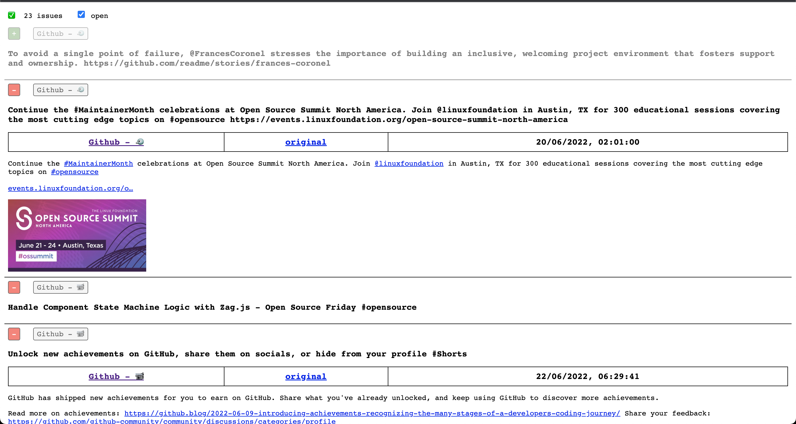

# Girssa - Web



This folder contains a web interface you can use to interface with Girssa.

If you're interested in the technical details, look at [`index.html`](./index.html).

It will provide (hopefully) all the details you need to create your own web interface for Girssa.

Minified code: [`index.min.html`](./index.min.html).

# Setup

In order to have the example file setup, you need to inject two encrypted values:

- `ENCRYPTED_TOKEN_TO_INJECT`: The PAT you'll be using to connect to GitHub's API.
- `ENCRYPTED_REPOSITORY_TO_INJECT`: The repository to use, format: `<owner>/<name>`.

In order to get the value encrypted, use the [`generate.js`](./generate.js) script:

```shell
FILE="index.min.html" \
  PASSWORD="<PASSWORD>" \
  TOKEN="<TOKEN>" \
  REPOSITORY="<OWNER>/<NAME>" \
  node web/generate.js
```
